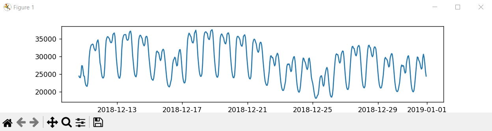
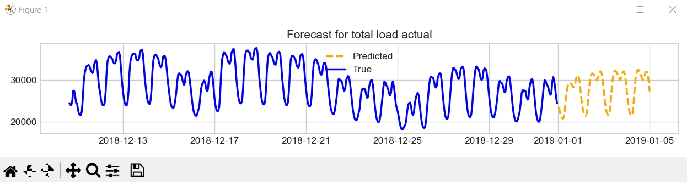
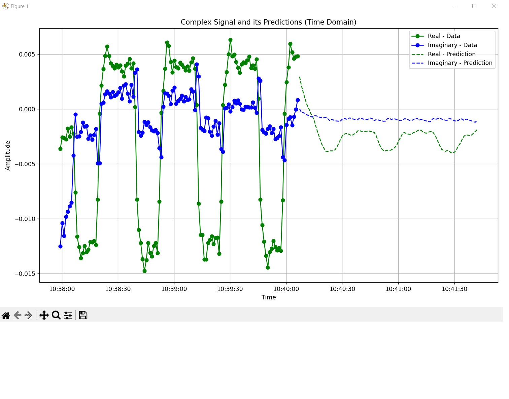

# Time Series Forecasting Demo with TinyTimeMixer

This project demonstrates time series forecasting using the `tsfm_public` library and the TinyTimeMixer model. It loads energy consumption data, performs preprocessing, generates forecasts, and visualizes the results.

Also, this repo contains a new file named: `frecuency.py`, this new file uses the same model to forecast radio frecuencies, this time the dataset is `RadComOta2.45GHz`.

## What is TinyTimeMixer?
It is one of the many pretrained models from the family of "Granite Time Series". This models are developed by IBM.
This models performs on principles of zero/few-shot learning, hence, it is used to provide predictions even with limited training data. This model is lightweight meaning it could run with minimial hardware requirements.
This model is useful in scenarios where series data is scarce or diverse.

[Further details here!](https://huggingface.co/ibm-granite/granite-timeseries-ttm-r1)

[Check this academic paper!](https://arxiv.org/pdf/2401.03955)

## Prerequisites

Before running the code, ensure you have the following installed:

-   Python 3.x
-   `venv` (virtual environment module)
-   `pip` (Python package installer)

## Setup

1.  **Create a virtual environment:**

    ```bash
    python -m venv venv
    ```

2.  **Activate the virtual environment:**

    -   On Windows:

        ```bash
        .\venv\Scripts\activate
        ```

    -   On macOS and Linux:

        ```bash
        source venv/bin/activate
        ```

3.  **Install the necessary dependencies:**

    ```bash
    pip install "tsfm_public[notebooks] @ git+[https://github.com/ibm-granite/granite-tsfm.git@v0.2.12](https://github.com/ibm-granite/granite-tsfm.git@v0.2.12)"
    ```

    ```bash
        pip install -r requirements.txt
    ```    


## Running the Demo

**Execute the `demo.py` script:**

    ```bash
    python demo.py
    ```
    
This script will:

  -   Load the energy consumption dataset (`energy_dataset.csv`).
  -   Fill missing data using forward fill.
  -   Display the last few rows of the preprocessed data.
  -   Generate a plot of the target time series.
  -   Load the TinyTimeMixer forecasting model (`ibm-granite/granite-timeseries-ttm-r1`).
  -   Create a forecasting pipeline.
  -   Generate forecasts for the target time series.
  -   Display the last few rows of the forecast.
  -   Generate and display a plot comparing the actual data with the forecast.

## Showing chart made with loaded data
The data loaded is used to build a chart.


## Showing forecast chart
Once the data is loaded and the forescast is done base on the mentioned data, the new chart is generated to show the forecast data.



## Dataset for demo.py

The dataset used in this demo is `energy_dataset.csv`, which contains hourly energy consumption data. It should be placed in the `archive` directory within the project root.

## Running the Frecuency Script

**Execute the `frecuency.py` script:**

This script loads radar signal data from an HDF5 dataset and performs time series forecasting on the real and imaginary components of complex signals using a pretrained TinyTimeMixer model.

```bash
    python frecuency.py -mod PULSED -sig Airborne-detection -snr 0 -num 0
```
```bash
        python frecuency.py -mod FMCW -sig "Radar Altimeter" -snr 0 -num 0
```

```bash
        python frecuency.py -mod "AM-DSB" -sig "AM radio" -snr 0 -num 0
```

```bash
        python frecuency.py -mod "PULSED" -sig "Air-Ground-MTI" -snr 0 -num 0
```


This script will:

- Load a complex radar signal from the RadComOta2.45GHz.hdf5 dataset using HDF5 format.
- Parse user-defined parameters for modulation type, signal type, SNR, and sample index via command-line arguments.
-   Extract and split the selected waveform into its real and imaginary components.
-   Plot the raw real and imaginary parts of the selected signal sample.
-   Normalize both real and imaginary components to prepare them for model input.
-   Construct a timestamped DataFrame combining the normalized components.
-   Load the pretrained TinyTimeMixer model (ibm-granite/granite-timeseries-ttm-r2) for time series forecasting.
-   Run a forecasting pipeline to predict the future values of the real and imaginary parts of the signal.
-   Denormalize the forecasted values to return them to their original scale.


## Showing forecast frecuency chart
Once the data is loaded and the forescast is done base on the data available in dataset `RadComOta2.45GHz.hdf5`.


## Dataset for frecuency.py

The dataset used in this code is `RadComOta2.45GHz.hdf5`, which contains data from different types of frecuencies. It should be placed in the `RadComOta2.45GHz` directory within the project root.

## Dependencies

-   `matplotlib`
-   `pandas`
-   `tsfm_public` (from `git+https://github.com/ibm-granite/granite-tsfm.git@v0.2.12`)
-   `torch>=1.8.0`
-   `numpy>=1.19.0`
-   `h5py>=3.1.0`
-   `matplotlib>=3.3.0`
-   `scikit-learn>=0.24.0`
-   `tqdm>=4.50.0`
-   `pandas>=1.1.0`
-   `seaborn>=0.11.0`
-   `scipy>=1.6.0`
-   `tensorboard>=2.5.0`

## Notes

# About demo.py
-   You can experiment with different TinyTimeMixer models by changing the model name in the `from_pretrained` function.
-   The `context_length` parameter controls the number of historical data points used for forecasting.
-   Feel free to modify the script to explore different forecasting scenarios and datasets.

# About frecuency.py
-   You can experiment plotting from the available data in the dataset `RadComOta2.45GHz`.
-   See how this code predicts possible frecuencies and plots its forecast!
-   Feel free trying to modify this code in order to improve the performance.

